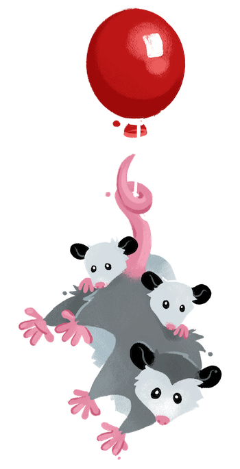

## proton

by GitHub Copilot
ProtonMail is an email service that prioritizes privacy and security. It uses end-to-end encryption, meaning that your emails are encrypted on your device before they ever reach ProtonMail servers. This ensures that even if someone were to intercept your email, they would not be able to read its contents. Only the recipient, with the correct decryption key, can read the email.

End-to-end encryption works like this:

When you send an email, it is encrypted on your device using the recipient's public key.
This encrypted email is sent through the internet. Even if intercepted, it cannot be read without the recipient's private key.
The recipient receives the email and decrypts it using their private key.
In addition to ProtonMail, Proton also offers other services:

ProtonVPN: A virtual private network service that encrypts your internet connection, preventing others from spying on your online activity.
ProtonDrive: A secure cloud storage service that uses end-to-end encryption to ensure that only you can access your files. It's similar to Google Drive or Dropbox, but with a focus on privacy and security.
ProtonCalendar: A privacy-focused calendar service that uses end-to-end encryption to keep your schedule private and secure.
These services are all built with the same focus on privacy and security, ensuring that your data is always encrypted and under your control.

ProtonMail is a great choice for anyone who values their privacy and wants to keep their emails secure. It's easy to use, offers a free tier with limited features, and has paid plans for those who need more storage or additional features. If you're looking for a secure email service that puts your privacy first, ProtonMail is a solid option.
Thanks Copilot! 

## Section Header

